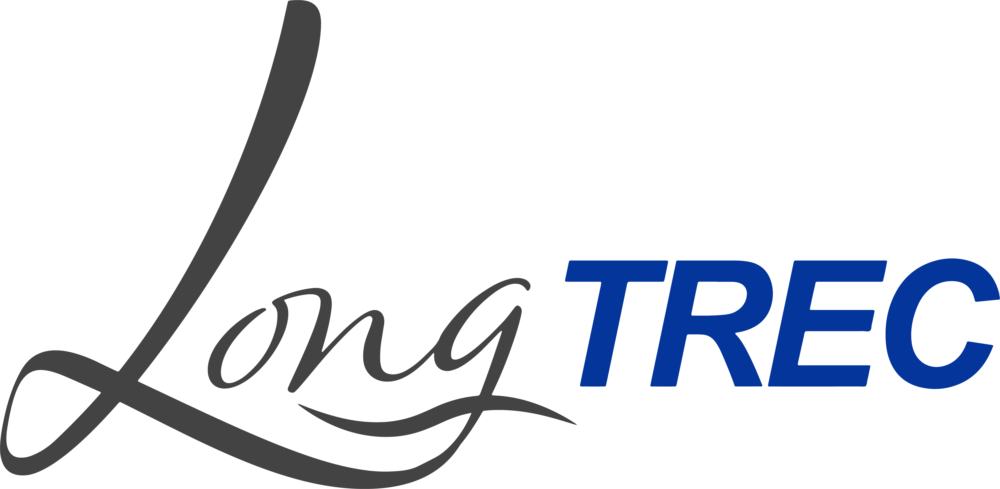

# Day 3 Agenda

## Goals
**Morning session: Differential expression analysis**
* To learn how long-read RNA-seq can be used for differential isoform expression/usage analysis and what are the current challenges
* To learn about specific case of expression analysis: allele-specific expression analysis

**Afternoon session: RNA modifications**
* Learn how long-read sequencing technologies are utilized for the study of RNA modifications
* Hands-on session for the study of the tRNAome

## Timetable

| Time | Activity | Details | Literature |
|------|---------|---------|------------|
| 9:00 - 9:30 | How to build your expression matrix and concept of DE analysis vs DIU | call and join, join and call |  |
| 9:30 - 10:30 | Hands on | tappAS, IsoTools | [tappAS](https://genomebiology.biomedcentral.com/articles/10.1186/s13059-020-02028-w), [IsoTools](https://isotools.readthedocs.io/en/latest/)|
| 10:30 - 11:00 | **Coffee Break** | | |
| 11:00 - 11:30 | Allele-specific expression | Specificity of long-reads * Introduction. * Biases and limitations. * Main steps. * Minimum input. * Expected output * Existing pipelines: LORALS, FALIR2, IDP-ASE |  [Review about allele-specific expression analyis](https://www.annualreviews.org/content/journals/10.1146/annurev-biodatasci-021621-122219), [LORALS](https://www.nature.com/articles/s41586-022-05035-y)|
| 11:30 - 12:30 | Hands on | analyze ASE dataset **Hands-on Task 1** Description of the data. QC and filtering of already mapped samples. **Hands-on Task 2** Allele-specific expression quantification **Hands-on Task 3** Allele-imbalance testing **Hands-on Task 4** Interpretation of results and output. Real example application **Conclusion and remarks** * |  |
| 12:30 - 13:30 | **Lunch break** | | |
| 13:30 - 14:30 | Introduction to epitranscriptomics | Overview of the field; use of long-read sequencing technologies for mapping RNA modifications; tRNA-specialized protocols and pipelines | |
| 14:30 - 15:00 | Hands-on | Mapping Nano-tRNAseq data | Tools: _minimap2_ |
| 15:00 - 15:30 | **Coffee Break** | | |
| 15:30 - 16:30 | Hands-on | Downstream processing: filtering, quality control, batch effect investigation, differential expression, diffenetial modifications | Tools: _AMaNITA_ |
| 16:30 - 17:00 | Closing remarks | Additional pipelines; modification-aware basecallers | |

## Learning Objectives

**Morning session: Differential expression analysis**
- understand the difficulties of assigning reads to isoforms
- understand biological mechanisms of allelic imbalance
- understand different sources of bias in allele-specific expression analysis

**Afternoon session: RNA modifications**
- understand the past and current challenges in the epitranscriptomics field
- understand why and how long-reads sequencing technologies are utilized for RNA modification detection
- familiarize with tools for epitranscriptomics data analysis

## Materials
* [Differential expression](theory/day3/Differential Expression.pdf): Slides for Join&Call, Call&Join and differential expression.
* [tappAS](theory/day3/LongTREC_SummerSchool_tappAS.pptx): Slides for tappAS analysis.
* [Haplotype analysis](https://github.com/longTREC/summer_school/blob/master/theory/day3/Haplotype%20analysis.pptx): Slides for allele-specific expression.
* [Epitranscriptomics](theory/day3/LongTREC_SummerSchool_Epitranscriptomics_NoSpoilers.pdf): Slides for epitranscriptomics.

## Data
* 

## Recommended Bibliography
* Bi, Yalan. et al. IsoTools 2.0: software for comprehensive analysis of long-read transcriptome sequencing data. Journal of Molecular Biology (2025). https://doi.org/10.1016/j.jmb.2025.169049
* Glinos, D.A., Garborcauskas, G., Hoffman, P. et al. Transcriptome variation in human tissues revealed by long-read sequencing. Nature (2022). https://doi.org/10.1038/s41586-022-05035-y  
* Cleary, S. and Seoighe, C. Perspectives on Allele-Specific Expression. Annual Reviews (2021). https://doi.org/10.1146/annurev-biodatasci-021621-122219
* De la Fuente, L., Arzalluz-Luque, A., Tardáguila, M., et al. tappAS: a comprehensive computational framework for the analysis of the functional impact of differential splicing. Genome Biology (2020). https://doi.org/10.1186/s13059-020-02028-w
* Lucas, M.C., Pryszcz, L. et al. Quantitative analysis of tRNA abundance and modifications by nanopore RNA sequencing. Nature Biotechnology (2023). https://doi.org/10.1038/s41587-023-01743-6

### Back

Back to [main page](../index.md).
